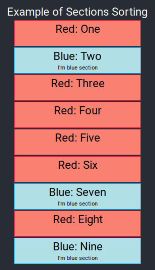

# Sorting React Components

This simple project presents way of sorting child components in React without changing theirs order by moving them.
Sole thing that have to be done is providing `order` attribute/prop for component and wrapping it using `SortableSectionsContainer`.


`SortableSectionsContainer` takes `sortable` prop which mean direction of sorting (ASC, DESC) and children, which can be any html node.

Sorting mechanism takes `order` parameter into account. When `order` has not been provided component will be threated like node with the lowest `order`. 
(In DESC strategy it will be at the beginning)


## Example usage

```
<SortableSectionsContainer sortable='ASC'>
    <RedSection key='Three' title='Three' order={3}/>
    <RedSection key='One' title='One' order={1}/>
    <BlueSection key='Two' title='Two' order={2}/>
    <RedSection key='Six' title='Six' order={6}/>
    <BlueSection key='Seven' title='Seven' order={7}/>
    <RedSection key='Four' title='Four' order={4}/>
    <RedSection key='Eight' title='Eight' order={8} />
    <BlueSection key='Nine' title='Nine' order={9}/>
    <RedSection key='Five' title='Five' order={5}/>
</SortableSectionsContainer>
```
Regardles of established order in html structure elements will be shown in correct order as show on below image.

Notice that children don't have to be of one typy. There can be placed completely different components.



## Running project 

In the project directory, you can run:

### `npm start`

Runs the app in the development mode.<br>
Open [http://localhost:3000](http://localhost:3000) to view it in the browser.

## Author
**Michał Cholewiński**, Software Engineer  
[cholewinskimichal.com](http://cholewinskimichal.com)    
[Eager To IT](https://eagertoit.com)